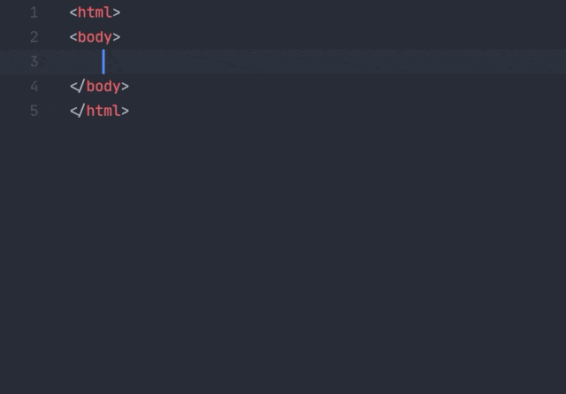
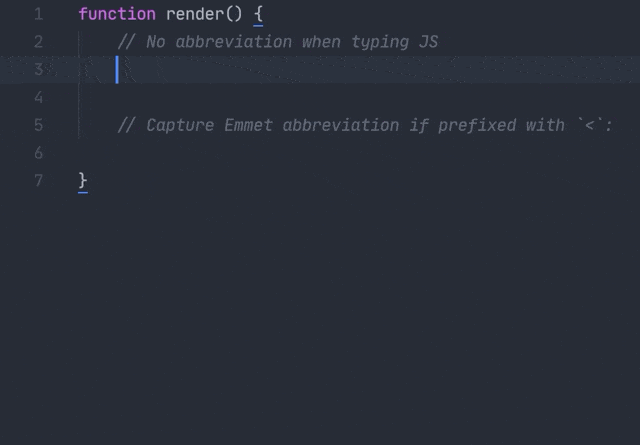
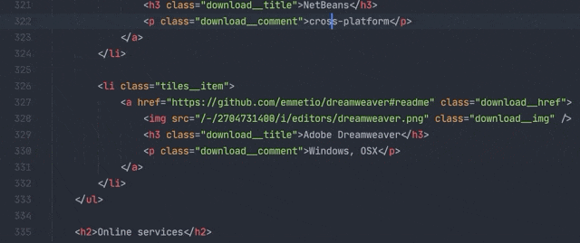

# Emmet 2 for Sublime Text editor

> This is the next version of Emmet plugin with greatly improved developer experience and new features. Read below for more details. Plugin is currently in beta stage and may contain bugs.

Emmet is a web-developer’s toolkit for boosting HTML & CSS code writing.

With Emmet, you can type expressions (_abbreviations_) similar to CSS selectors and convert them into code fragment with a single keystroke. For example, this abbreviation:

```
ul#nav>li.item$*4>a{Item $}
```

...can be expanded into:

```html
<ul id="nav">
    <li class="item1"><a href="">Item 1</a></li>
    <li class="item2"><a href="">Item 2</a></li>
    <li class="item3"><a href="">Item 3</a></li>
    <li class="item4"><a href="">Item 4</a></li>
</ul>
```

## Features

* **Familiar syntax**: as a web-developer, you already know how to use Emmet. Abbreviation syntax is similar to CSS Selectors with shortcuts for id, class, custom attributes, element nesting and so on.
* **Dynamic snippets**: unlike default editor snippets, Emmet abbreviations are dynamic and parsed as-you-type. No need to predefine them for each project, just type `MyComponent>custom-element` to convert any word into a tag.
* **CSS properties shortcuts**: Emmet provides special syntax for CSS properties with embedded values. For example, `bd1-s#f.5` will be exampled to `border: 1px solid rgba(255, 255, 255, 0.5)`.
* **Available for most popular syntaxes**: use single abbreviation to produce code for most popular syntaxes like HAML, Pug, JSX, SCSS, SASS etc.

[Read more about Emmet features](https://docs.emmet.io)

## Installation

> Please remove old Emmet plugin (https://packagecontrol.io/packages/Emmet) first, otherwise new plugin won’t work.

Due to development stage, this package must be installed from custom repository:

1. In Sublime Text, open `Command Palette`, find and run `Package Control: Add Repository` command
2. Enter the following URL into dialog and hit Enter: https://github.com/emmetio/sublime-text-plugin/releases/latest/download/registry.json
3. From `Command Palette`, run `Package Control: Install Package` command.
4. In opened packages list, find `Emmet2` package and install it

If you’re unable to find `Emmet2` package on last step or installed package doesn’t work as expected, restart Sublime Text and try again

## Expanding abbreviation

If you used [previous version](https://github.com/sergeche/emmet-sublime) of Emmet plugin, you already know how to expand abbreviations: type something like `ul>li.items*4` and hit <kbd>Tab</kbd> or <kbd>Ctrl-E</kbd>. While this approach generally works, it has lots of downsides:

* **Tab key hijacking**: Emmet binds Tab key for expanding abbreviations so user is unable to insert native Sublime Text snippet or put tab right after word since *almost every word can be abbreviation* for Emmet.
* **No preview of expanded abbreviations**: writing complex abbreviations becomes trial and error with expand/undo/expand actions.
* **Unpredictable result**: it’s not possible to determine what happens when you hit <kbd>Tab</kbd> key, it will either expand abbreviation, insert native snippet or just output tab character.

In this plugin, abbreviation expander acts as *autocomplete provider* and automatically captures abbreviation as you type.

When you start typing in *Emmet-supported context* (HTML, CSS, Slim etc.) Emmet detects if you’re typing something similar to abbreviation and adds underline which indicates *captured abbreviation*. When captured abbreviation becomes *complex* (e.g. contains attributes or multiple elements), you’ll see a preview of expanded abbreviation every time caret is inside it. Hit <kbd>Tab</kbd>key *inside captured abbreviation* to expand it, hit <kbd>Esc</kbd> to remove mark from abbreviation so you can use <kbd>Tab</kbd> for expanding native ST snippets or insert tab character.



If you already have an abbreviation in document and you want to expand it, move caret to the end of abbreviation and invoke autocomplete (<kbd>Ctrl+Space</kbd> by default) to capture abbreviation:


### JSX support

> Make sure your document syntax is set to JSX, not JavaScript

Writing Emmet abbreviations in JSX is a bit tricky: in most cases you’d expect Tab key to expand native Sublime Text snippets and use Emmet for specific context only. So a default abbreviation capturing for every variable or snippet would annoy you.

To solve this problem, Emmet uses *prefixed abbreviations* in JSX: it will capture and expand abbreviation only if it’s prefixed with a specific symbol(s). By default, it’s a `<` character:



Emmet detects camel-cased module notation in JSX: `Foo.Bar` will be expanded as `<Foo.Bar></Foo.Bar>` instead of `<Foo className="Bar"></Foo>`. Expression attributes are supported as well: `div[class={getClass('foo')}]`.

### CSS support

In CSS, Sublime Text uses slightly different autocomplete behavior by default: it displays completions by default and doesn’t re-populate completions list as you type further, which prevents Emmet from building proper dynamic completion. To overcome this issue, Emmet displays abbreviation preview right after caret as *phantom*:


In Emmet 2, CSS abbreviations are enhanced with dynamic color snippets: you can type, for example, `#f.5` to quickly get `rgba(255, 255, 255, 0.5)`.

### Disable abbreviation capturing

To disable automatic abbreviation capturing, go to _Preferences > Package Settings > Emmet2 > Settings_ menu item and set `auto_mark` option to `false`. With abbreviation capturing disabled, you have several options to expand abbreviations manually:

* You can type abbreviation (or pur caret behind existing abbreviation) and run `Emmet: Expand Abbreviation` action from command palette. It is recommended to set [keyboard shortcut](https://www.sublimetext.com/docs/3/key_bindings.html) for this action:

```json
// Put this code snippet into your .sublime-keymap file
// and modify `keys` value with desired shortcut
{
    "keys": ["ctrl+e"],
    "command": "emmet_expand_abbreviation"
}
```

* Another option is to run `Emmet: Enter Abbreviation Mode` command: the `⋮>` mark indicates that you are in _explicit abbreviation mode_ and everything you type will be treated and validated as Emmet abbreviation. You can then hit <kbd>Tab</kbd> or <kbd>Enter</kbd> key to expand it, <kbd>Esc</kbd> to dispose.


It is recommended to add keyboard shortcut for this action as well:

```json
// Put this code snippet into your .sublime-keymap file
// and modify `keys` value with desired shortcut
{
    "keys": ["ctrl+."],
    "command": "emmet_enter_abbreviation"
}
```

### Tag preview

Another new feature of Emmet 2 is inline preview of opening tag. When you move caret inside _name of closing tag_ and its matching open tag _is not visible on screen_, you’ll see an inline tag preview:



Click on this preview will jump to open tag.

This option is disable by default. To enable it, go to _Preferences > Package Settings > Emmet2 > Settings_ and set `tag_preview` option to `true`.

## More actions

All the rest actions like [Wrap with Abbreviation](https://docs.emmet.io/actions/wrap-with-abbreviation/), [Balance](https://docs.emmet.io/actions/match-pair/), [Select Item](https://docs.emmet.io/actions/select-item/) etc. are also supported but doesn’t have default key bindings. You should either invoke these actions via Command Palette or [create your own keyboard shortcuts](https://www.sublimetext.com/docs/3/key_bindings.html) (see [Default.sublime-commands](./Default.sublime-commands) file for list of available actions). A final Emmet for Sublime Text plugin will provide convenient UI for fine-tuning Emmet options and key bindings.

## Development

In order to work with plugin source code, don’t forget to install [py-emmet](https://github.com/emmetio/py-emmet) dependency. After checking out source code, go to repo folder and run

```sh
pip install -r requirements.txt -t .
```
